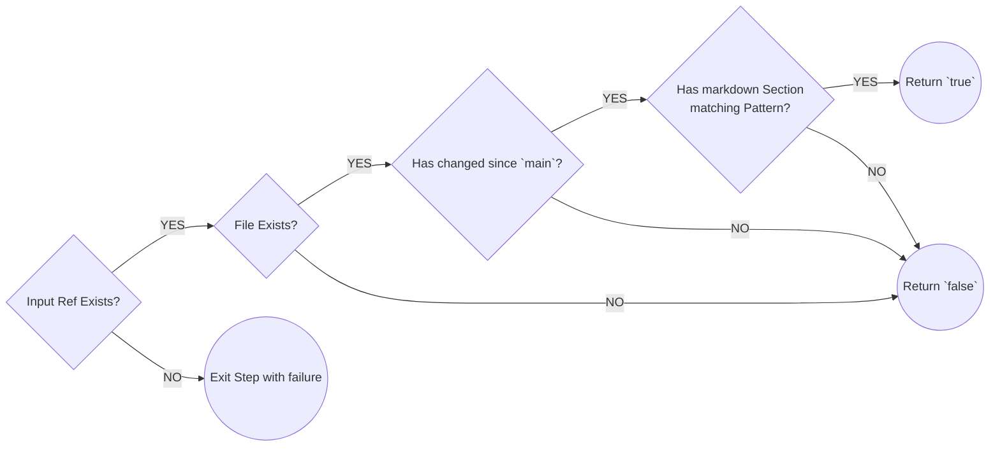

# CHANGELOG CI

> Github Action for `CHANGELOG` **Continuous Integration**

## Features

1. Check whether your CHANGELOG was changed since `main` branch
2. Check if a new `Markdown Section` was added
3. Check if **Section Header** includes `Sem Ver` (see [Semantic Versioning](https://semver.org/))
4. If `version` supplied, check if **Section Header** includes that specific Semantic Version

## Get started

## Use Cases

Implementing a CI check for your `CHANGELOG.md`, during your release process.
